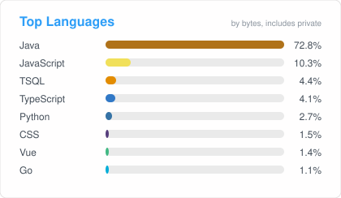

# Hi there, I'm bpzhang 👋

## 👨‍💻 About Me

I'm a **full-stack** engineer spanning product UIs, Java/Python backends, **AWS** cloud, and **ML** pipelines. Day to day I also ship platforms, CI/CD, and restaurant / franchisee SaaS.

- 🔭 **Current focus:** Full-stack product work, AWS, ML, Kubernetes platforms, and franchisee SaaS
- 🛠️ **How I work:** 55 original repos — mostly private product and ops code, plus a few public tools
- 💬 **Ask me about:** Full-stack apps, AWS, ML, Java services, Kubernetes, Aliyun automation
- ⚡ **Fun fact:** I keep a lot of “small sharp tools” around — scripts, Chrome extensions, macOS utilities
- 📍 US

## 🗺️ What I build

Mapped from my original repositories (not forks):

| Area | Stack | What it covers |
| --- | --- | --- |
| **Full stack** | TypeScript · JavaScript · Java · Python | Web consoles, Chrome extensions, dine portals, end-to-end product surfaces |
| **AWS & Cloud** | AWS · Aliyun · Docker · K8s | Cloud architecture, CI/CD, base images, multi-cluster ops |
| **ML & Data** | Python · Pandas · scikit-learn | Data cleanup, ordering intelligence, trend / model-assisted pipelines |
| **Platform & Kubernetes** | Go · TypeScript · Python | Multi-cluster consoles, cluster ops, control-plane style platforms |
| **Restaurant & Commerce SaaS** | Java · TypeScript | Franchisee billing/settlement, dine portals, takeout, marketing rules |
| **Distributed systems** | Java · Go | Snowflake / ID generation, delayed jobs, Nacos, RPC, API routing |
| **Developer tools** | Python · JavaScript · Swift · Ruby | Repo sync, bookmark tools, floating macOS kits |

Public originals are linked below. Most other work is private.

## 🛠️ Skills, Technologies & Tools

### Languages

### Backend

### Frontend

### DevOps & Cloud

### Data Science & ML

### Tools

## 🚀 Featured Projects

Public repositories worth a look:

### [kube-tide](https://github.com/bpzhang/kube-tide)
🌊 Kubernetes multi-cluster management platform (Go + React): clusters, nodes, workloads, logs, and day-2 operations in one console.

### [bookmark-checker](https://github.com/bpzhang/bookmark-checker)
🔖 Chrome extension that checks and validates bookmarks so the browser stays usable.

### [distributed-tools](https://github.com/bpzhang/distributed-tools)
🧩 Java utilities around distributed systems — the public counterpart to ID generation, routing, and similar service building blocks.

## 📦 Repo snapshot

| | Count |
| --- | ---: |
| Original repositories | 55 |
| Forks | 48 |
| Public originals | 9 |
| Private originals | 46 |

**Language mix (original repos):** Java (25) · Python (8) · TypeScript (5) · JavaScript (4) · Go (3) · Swift (2)

## 📈 GitHub Stats

## 🏷️ Badges

## 📫 Connect with Me

---

**Thanks for visiting. Most of my work is private — the public repos above are the best place to start.**

  
If you’d like to support my work, you can buy me a coffee ☕️

  

